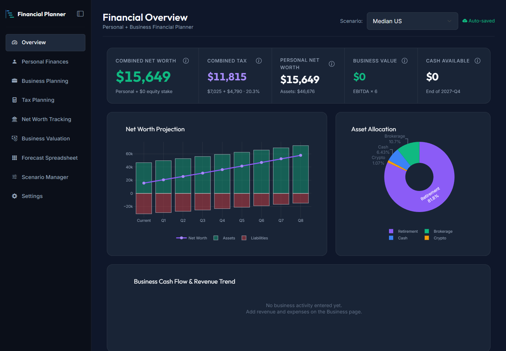
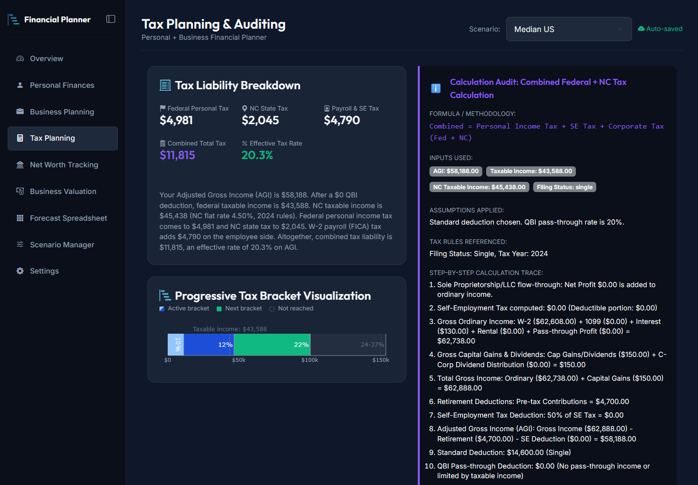
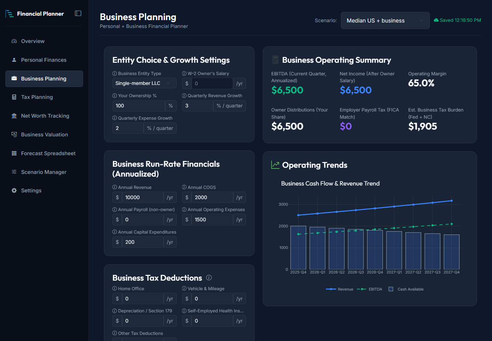
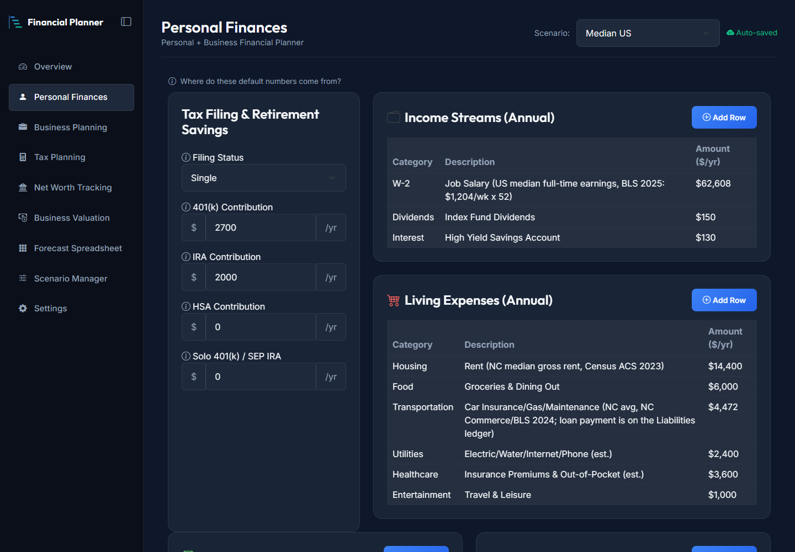
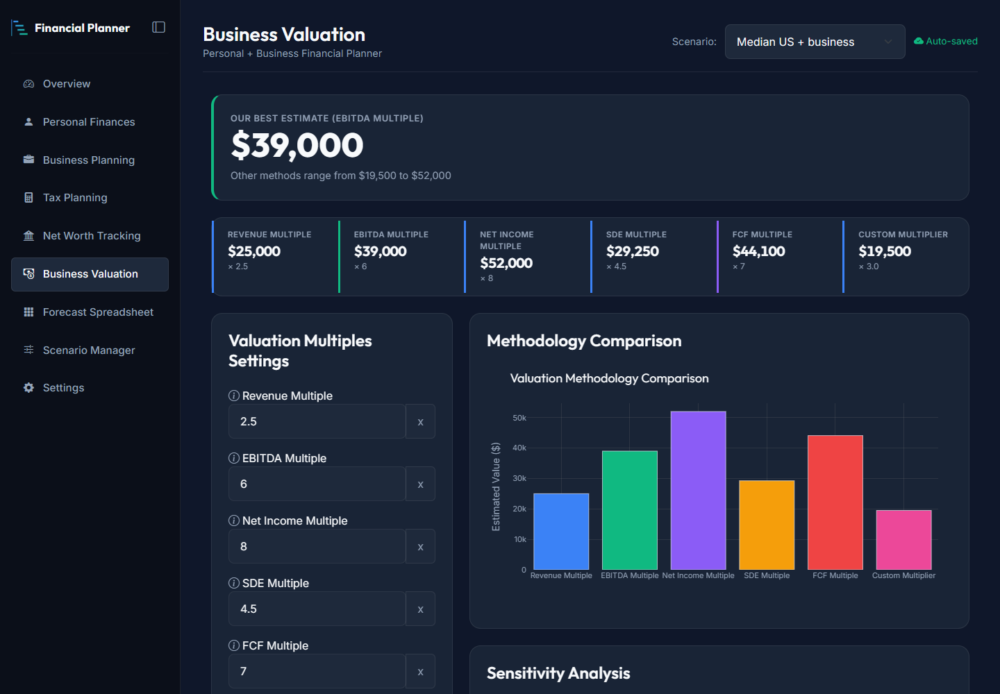
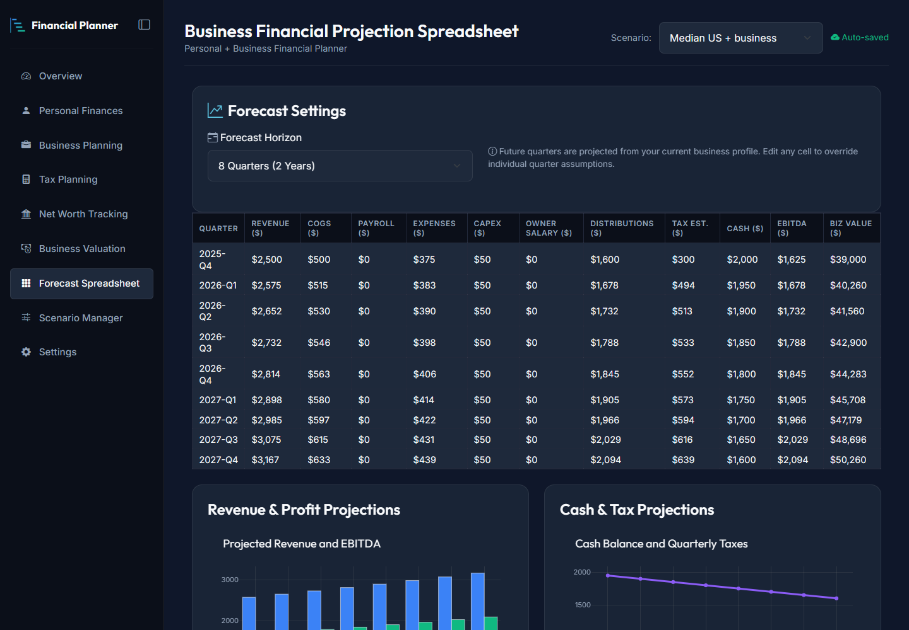
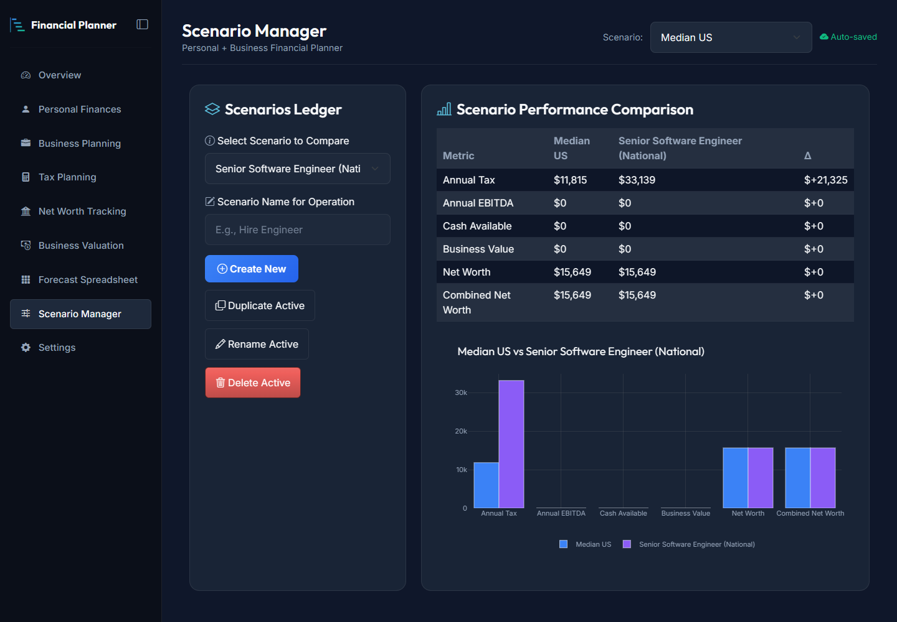
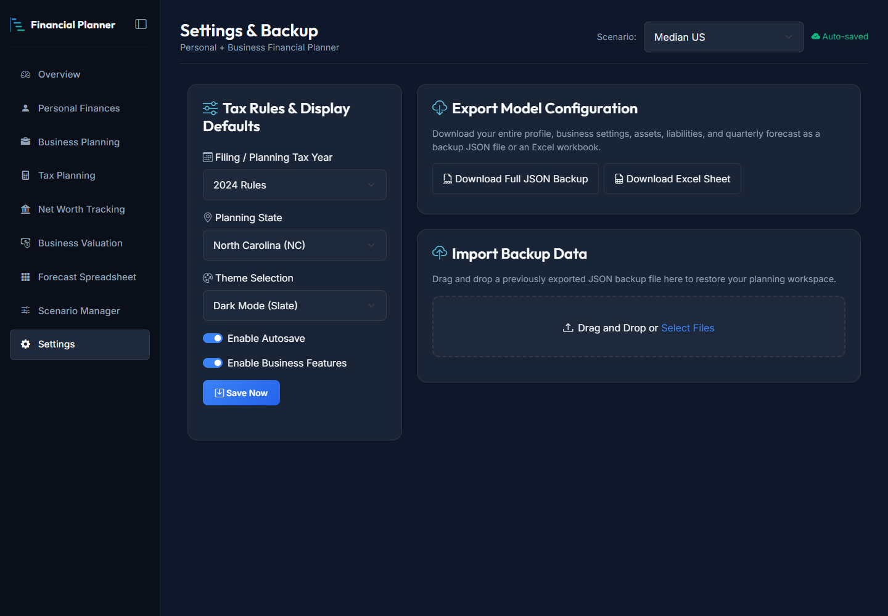

# Personal & Business Financial Planner — Marketing Brief

*Internal document for the marketing team. Everything here is drawn from what the product does today. Where something is not true yet, it is called out under "What we cannot claim."*

---

## 1. One-line pitch

**A private, run-it-on-your-own-computer planner that shows what you actually take home — across your paycheck, your side business, and your net worth — and lets you test "what if" decisions before you make them.**

Shorter: *See your whole financial picture, personal and business, without handing your data to anyone.*

---

## 2. What it is

A local web application (it opens in your browser, but runs entirely on your own machine) that combines, in one place:

- **Personal finances:** income, living expenses, assets, debts, retirement contributions.
- **A small business:** revenue, costs, owner pay, tax deductions, and a quarter-by-quarter projection.
- **Tax estimates:** federal and North Carolina income tax, self-employment tax, payroll (FICA) tax, and the pass-through business deduction (QBI), with a step-by-step explanation of every number.
- **Net worth and cash flow:** where you stand now and an eight-quarter projection, including what happens to your leftover cash.
- **Business valuation:** what the business may be worth using five common methods plus a custom one, with a sensitivity chart.
- **Scenarios:** save alternative versions of your plan (a raise, a new job, going freelance, forming an S-Corp) and compare them against your baseline.

It starts with realistic North Carolina median figures and ready-made example scenarios, so a first-time user sees a working plan within a minute of opening it.

---

## 3. Who it is for

### Primary audience

**1. The side-hustler and solo freelancer (US, W-2 job + self-employment income)**
- Has a day job *and* a side business, consulting practice, or freelance income.
- Pain: unsure how much tax the side income really adds, whether to set up an LLC or S-Corp, and how much to set aside for quarterly estimated payments.
- Hook: "Add your side income and see the *real* extra tax, not a guess."

**2. The small-business owner and consultant (sole proprietor, LLC, S-Corp, C-Corp)**
- Needs one place to see personal and business money together.
- Pain: spreadsheets that don't tie personal taxes to business profit; uncertainty about owner salary vs. distributions; no sense of what the business is worth.
- Hook: "Compare entity types and owner-salary choices side by side before you talk to your CPA."

**3. The career-minded professional weighing a decision (e.g. software engineers)**
- Considering a raise, a job change, or going independent.
- Pain: gross salary comparisons hide taxes and take-home reality.
- Hook: "What does $125K really look like after tax, compared to what you earn now?" (Built-in Junior/Senior Software Engineer scenarios demonstrate this.)

### Secondary audiences

- **People who care about privacy** and don't want to connect bank accounts or upload financial data to a cloud service.
- **Financial coaches, CPAs, and bookkeepers** who want a quick, explainable scenario tool to use in conversations with clients (see "Positioning against the alternatives").
- **Students and educators** learning how US federal, state, payroll, and self-employment taxes fit together — every tax figure comes with a worked, line-by-line explanation.

### Not a fit (be upfront about this)

- Anyone outside the US, or anyone who needs a state other than **North Carolina** today.
- People who want automatic bank syncing or transaction categorization (this is a planner, not a budgeting tracker).
- Complex situations: itemized deductions, tax credits, AMT, rental portfolios, multi-state filing, large estates.

---

## 4. Benefits (what the customer gets)

Lead with outcomes, support with features.

| Customer outcome | Product feature that delivers it |
|---|---|
| **"I know what I'll actually owe."** | Federal + NC income tax, self-employment tax, payroll tax, and the QBI deduction, each with a transparent step-by-step breakdown. Click any number to see how it was calculated. |
| **"I can test a decision before making it."** | Scenario manager: duplicate your plan, change one thing (entity type, owner salary, retirement contributions, income), and compare tax, cash, and net worth against baseline. |
| **"My business and personal money finally connect."** | One plan covers both. Business profit flows into personal taxes; owner pay and distributions flow into personal cash flow. |
| **"I can see where I'm heading."** | Eight-quarter net worth projection, plus an editable quarter-by-quarter business forecast (up to 10 years). |
| **"I'm not leaving money on the table."** | Tailored tax-strategy suggestions based on *your* numbers (retirement and HSA room, Solo 401(k)/SEP, S-Corp election, quarterly estimates, 0% capital-gains room, home-office deduction). |
| **"I know what my business might be worth."** | Valuation using revenue, EBITDA, net-income, owner-earnings (SDE), and cash-flow multiples, with adjustable assumptions and a sensitivity chart. |
| **"My data stays mine."** | Runs on the user's own computer. No account, no cloud, no tracking, no bank connection. Data is stored as plain files the user controls; one-click JSON/Excel backup and restore. |
| **"I can trust the math."** | Calculations are covered by automated tests, checked against independent hand calculations, and use the official federal and NC figures for tax years 2021–2026. |

### Emotional benefit (for messaging, not for claims)

Confidence and calm: replacing "I think I owe about…" with a number you can see the working for.

---

## 5. Key features at a glance

- **Overview dashboard:** net worth, combined tax, business value, and cash at a glance, with charts and a one-click "show the calculation" panel.
- **Personal Finances:** income streams (with frequency and taxable flag), expenses, assets, debts, retirement and HSA contributions, and a leftover-cash allocator (savings / debt paydown / brokerage).
- **Business Planning:** entity type (sole proprietorship, single- or multi-member LLC, S-Corp, C-Corp), ownership percentage, owner salary, growth assumptions, run-rate financials, and business tax deductions (home office, vehicle, depreciation/Section 179, self-employed health insurance, other).
- **Tax Planning:** liability breakdown, progressive bracket visualizer, full audit trail, tailored strategies.
- **Net Worth Tracking:** asset and debt allocation and projection.
- **Business Valuation:** multiple methods plus sensitivity analysis.
- **Forecast Spreadsheet:** editable quarterly projection with override of any quarter.
- **Scenario Manager:** create, duplicate, rename, delete, and compare.
- **Settings & Backup:** tax year (2021–2026), light/dark theme, autosave, personal-only mode that hides business features, JSON and Excel export, restore from backup.
- **Accessibility and polish:** light and dark themes, keyboard navigation, screen-reader labels, responsive layout down to phone width, print-friendly pages, and bundled fonts/icons so it works with no internet connection.

---

## 5a. Screenshots

All screenshots are the real application running on built-in sample data, dark theme, 1440 px wide. The personal screens (Overview, Personal Finances, Tax Planning, Scenario Manager, Settings) use the **"Median US"** scenario: a $62,608 salary, which is the BLS median full-time weekly earnings of $1,204 times 52 (2025). The business screens (Business Planning, Business Valuation, Forecast) use the same person plus the sample $10K side business, since a plain employee has no business to show. Files are in [`docs/screenshots/`](docs/screenshots/). Each shows invented sample figures only, with no personal data.

| Screen | What it shows | Suggested use |
|---|---|---|
|  | **Overview:** headline numbers in one card, net worth projection, asset allocation, business trend | Hero image, landing page, app-store style listing |
|  | **Tax Planning:** liability breakdown, bracket visualizer, and the full step-by-step calculation trail | "Every number shows its work" — trust and transparency messaging |
|  | **Business Planning:** entity type, owner pay, run-rate financials, and tax deductions beside a live operating summary | Small-business and freelancer audiences |
|  | **Personal Finances:** income, expenses, assets, debts, and retirement contributions | Everyday-user audience; shows the starting point is already filled in |
|  | **Business Valuation:** several valuation methods plus a sensitivity chart | "What is my business worth?" messaging |
|  | **Forecast Spreadsheet:** editable quarter-by-quarter projection | Planning and "what happens next year" messaging |
|  | **Scenario Manager:** Median US compared side by side with a Senior Software Engineer salary — tax, EBITDA, cash, and net worth, as a table and a chart | The "test the decision first" story |
|  | **Settings & Backup:** tax year, theme, autosave, JSON/Excel export and restore | Privacy and "your data stays yours" messaging |

*To regenerate after a UI change: start the app (`python run.py`), then capture each page with a headless browser at 1440 x 1000 (for example Chrome's `--headless --screenshot` option). Use the sample data so no personal numbers appear. A light-theme set and a phone-width set would be useful additions.*

---

## 6. Differentiators / positioning

**Against spreadsheets:** same flexibility, but the tax logic is built in, tested, and explained, so users don't maintain their own formulas.

**Against budgeting apps (Mint-style, YNAB, etc.):** those track past spending by syncing bank accounts. This *plans forward* and focuses on taxes, business income, and decisions. Nothing is synced or uploaded.

**Against tax software (TurboTax-style):** those file a return once a year. This is a year-round "what if" tool and does not file anything.

**Against online calculators:** one-off calculators handle one question at a time. This keeps a single plan and compares scenarios across tax, cash, net worth, and business value.

**Against hiring a planner or CPA:** it is not a replacement. It makes the conversation faster and better-informed. (This is also a good partnership angle — see audience #2 secondary.)

**Our three strongest differentiators**
1. **Privacy-first by design** — local, no account, no data leaves the machine.
2. **Personal + small-business together** — most consumer tools ignore the business; most business tools ignore your personal taxes.
3. **Every number is explained** — a visible calculation trail, not a black box.

---

## 7. Proof points we can use today

- Runs fully offline; all fonts, icons, and styles are bundled (verified by an automated test).
- Calculations covered by **89 automated tests**, including hand-checked tax examples.
- Federal and NC tax rules for **2021 through 2026**, with the source of default figures cited inside the app (U.S. Census Bureau, BLS, Experian, Fidelity, etc.).
- **Eight ready-made scenarios** covering common situations: Median US earner, Junior and Senior Software Engineer, freelancer, S-Corp consultant, multi-member LLC with a 50% partner, C-Corp with salary plus dividends, and a median earner with a $10K side hustle.
- Open-source-style project structure with contribution guidelines.

*Do not invent customer counts, testimonials, ratings, or savings figures. None exist yet.*

---

## 8. What we cannot claim (important — keep marketing compliant)

- **It is not financial, tax, or legal advice.** Never imply otherwise. Use "estimate," "plan," "explore," "model" — not "advise," "guarantee," or "optimize your taxes."
- **Do not promise savings.** The tax tips show *estimated* effects of changes; they are conversation starters for a professional, and say so in the product.
- **Do not claim it files taxes, e-files, or replaces a CPA.**
- **State coverage is North Carolina only.** Do not say "all 50 states" or "any state."
- **Not all tax situations are modeled.** Currently not included: itemized deductions, tax credits (such as child credits), AMT, passive-loss and basis rules, net-operating-loss carryforwards, multi-state returns, and the specialized-service phase-out for the pass-through deduction. Describe it as covering "common situations," not "everything."
- **Defaults are examples, not predictions.** The starting figures are North Carolina medians and illustrative scenarios.
- **Do not claim bank-level security features** (encryption, certifications). Privacy comes from the data never leaving the user's computer, not from security tooling.
- **Do not claim mobile apps, cloud sync, multi-user accounts, or automatic updates** — none exist.

Suggested standard footer: *"For planning and education only. Not financial, tax, or legal advice. Estimates use simplified rules; consult a qualified professional."*

---

## 9. Current limitations the team should know before demos

- **Setup requires some technical comfort today:** the user needs Python 3.11+ and Git and runs it from a terminal. This is the biggest barrier for the non-technical audiences above. A one-click installer or packaged app would widen the market substantially.
- **Single user, single computer.** No sync between devices; no sharing a plan with a spouse or advisor except by exporting a backup file.
- **North Carolina only** for state tax.
- **Tax years:** 2021–2026 are included; later years need rule files added (a small, documented task).
- **Data entry is manual.** No bank or payroll imports.
- **Business depreciation is a single yearly amount**, not an asset-by-asset schedule.

---

## 10. Suggested messaging

**Headlines**
- "Know what you'll keep. Before you decide."
- "Your whole financial picture — personal and business — and nobody else sees it."
- "Side income, real taxes, real answers."
- "Test the decision first. Then make it."

**Short descriptions**
- *Tweet-length:* A private, offline planner for freelancers and small-business owners. See your real taxes, compare scenarios, and project your net worth — all on your own computer.
- *App-store style:* Plan personal and small-business finances together. Estimate federal and state taxes with a full explanation of every number, compare "what if" scenarios, project cash flow and net worth, and value your business. No account. No cloud. Your data stays on your device.

**Tone:** plain-spoken, reassuring, precise. Avoid hype and finance jargon; when a term is unavoidable (QBI, SDE, S-Corp), define it in one sentence.

---

## 11. Suggested demo script (5 minutes)

1. **Open the Overview.** "This is a typical North Carolina earner. Net worth, tax, and cash are right here." (30 sec)
2. **Click the info icon on Combined Tax.** Show the step-by-step trace. "Every number shows its work." (45 sec)
3. **Switch scenario to "NC Median + $10k Side Hustle."** Show tax and net worth change. "Here's what the side business really adds." (60 sec)
4. **Go to Business → add a home-office deduction.** Show tax drop. "Deductions flow straight into your taxes." (60 sec)
5. **Switch to "S-Corp Consultant."** Compare to baseline in the Scenario Manager. "Entity choice, tested before you file anything." (60 sec)
6. **Open Settings.** Point out theme, backup export, and "your data never leaves this computer." (45 sec)
7. **Close with the disclaimer:** estimates for planning, not advice.

---

## 12. FAQ (draft answers)

**Is my data safe?** It never leaves your computer. There's no account and no cloud. Keep regular backups using the built-in export.

**Does it connect to my bank?** No, by design.

**Does it file my taxes?** No. It estimates and explains; it doesn't file.

**How accurate are the tax numbers?** They use official federal and North Carolina figures for each tax year and are checked by automated tests, but they are estimates built on simplified rules. Use them for planning, and confirm with a professional before acting.

**Can I use it outside North Carolina?** Not yet — state tax is NC only.

**Can I use it without a business?** Yes. A personal-only mode hides all business features.

**Can I share it with my spouse or accountant?** Export a backup file and they can import it into their own copy.

**What does it cost?** *(Pricing and licensing are not defined in the product — marketing/leadership to decide.)*

---

## 13. Open questions for marketing and leadership

1. **Pricing and licensing model** (free/open source, one-time purchase, subscription?).
2. **Distribution:** will we ship an installer or packaged app to remove the Python/Git requirement?
3. **Roadmap messaging:** which additional states, credits, and itemized-deduction support should we promise, and when?
4. **Channel strategy:** freelancer communities, small-business and S-Corp forums, privacy-focused audiences, CPA/coach referral partnerships.
5. **Branding:** the product name, logo, and brand color are placeholders today.
6. **Legal review** of the disclaimer language and any marketing claims before launch.
